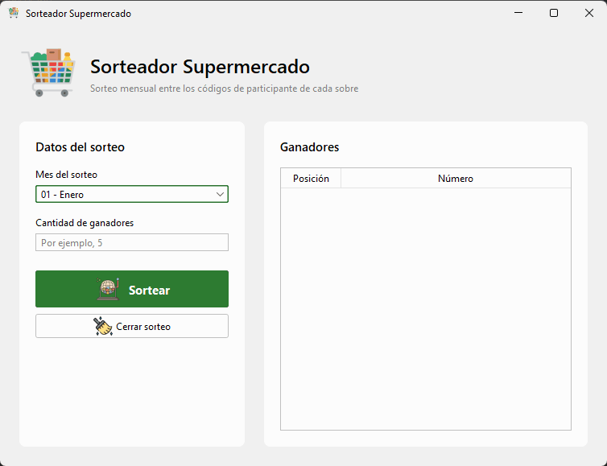

# Sorteador Supermercado

App de escritorio en Java para los sorteos mensuales de un supermercado. La hice sola en agosto de 2025, como ejercicio del curso de Java para principiantes de TodoCode, para afianzar lo que venía viendo y experimentar con Swing: sé que hoy casi no se usa en la industria, pero me pareció divertido. En octubre de 2026 la retomé para el portfolio.

## Problema que resuelve

Cada cliente que entrega un sobre con tickets recibe un código de 8 dígitos: día de entrega, mes y número de ticket. Por ejemplo, el sobre del 19/09 con el ticket 0158 es `19090158`. El encargado elige el mes y la cantidad de ganadores, y los va sacando de a uno.

Lo difícil es que cada número sorteado sea un código posible: el rango de días cambia según el mes, el código lleva ceros adelante (`07090045`, no `790045`) y nadie puede ganar dos veces en el mismo sorteo.

## Demo



## Tecnologías

Java 24, Swing con [FlatLaf](https://www.formdev.com/flatlaf/), Gradle 9 y JUnit 5.

## Cómo funciona

La clase `Sorteo` (paquete `logica`) tiene las reglas, y la ventana `Principal` (paquete `igu`) solo lee los datos y muestra los ganadores.

Las decisiones que tomé y por qué:

- **Sorteo el día y el ticket por separado** y armo el código con `String.format("%02d%02d%04d", ...)`. Un número al azar entre `01090001` y `30099999` podría dar `15100000`, que no es un código de septiembre.
- **Uso `YearMonth` para saber cuántos días tiene el mes.** La primera versión tenía los días escritos a mano y febrero nunca tenía 29.
- **Si sale un repetido, vuelvo a sortear.** Hay unos 300.000 códigos por mes, así que casi no pasa.
- **Bloqueo el mes y la cantidad mientras el sorteo está abierto**, para no mezclar ganadores de dos meses.
- **Separé la lógica de la interfaz** para poder testearla. Comparé 24.000 ganadores con la misma semilla antes y después del cambio, y dieron idénticos.
- **Reescribí la ventana a mano.** El editor de NetBeans generaba anchos fijos que cortaban el texto de los botones.

## Cómo correrlo

Necesitás un JDK 17 o superior. Si no tenés Java 24, Gradle lo descarga solo.

```bash
git clone https://github.com/solalcaraz/sorteador-supermercado.git
cd sorteador-supermercado
./gradlew run     # en Windows: gradlew.bat run
./gradlew test
```

## Qué aprendí y qué mejoraría

**Qué aprendí**

- A armar una interfaz en Swing con tablas, diálogos y eventos de botones.
- Que con la lógica adentro de la ventana, la única forma de probarla era hacer click. Separada, se puede testear.

**Qué mejoraría**

- Exportar o imprimir los ganadores: hoy se pierden al cerrar el sorteo.
- Elegir el año además del mes. Hoy toma el año en curso, y eso solo importa para febrero.
